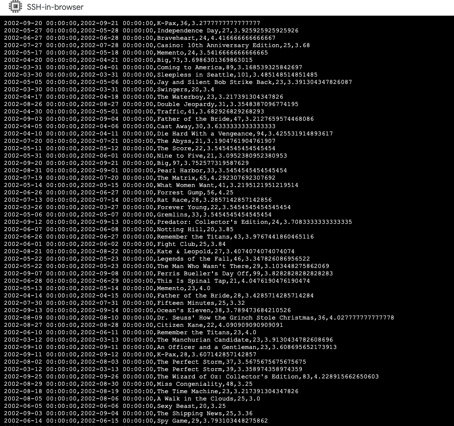
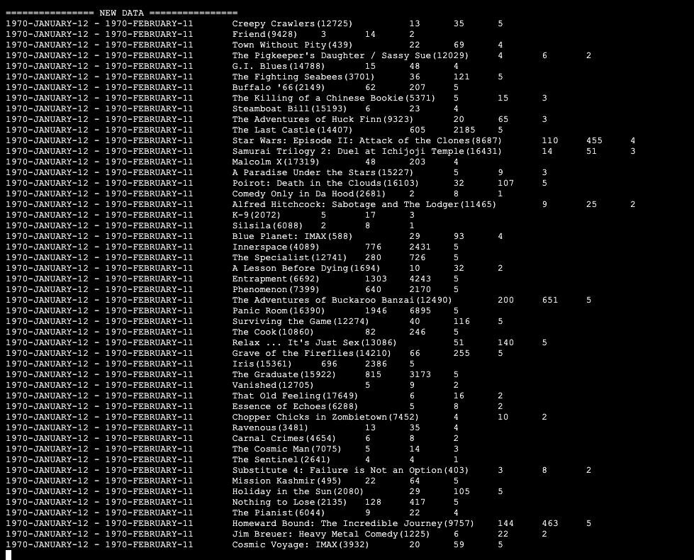
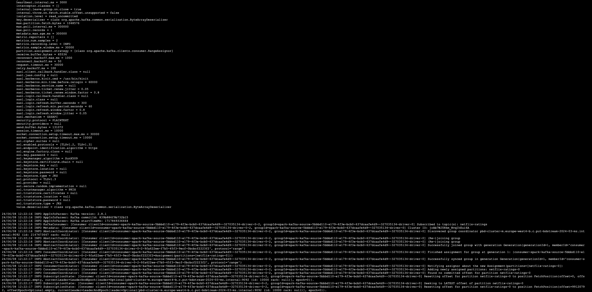
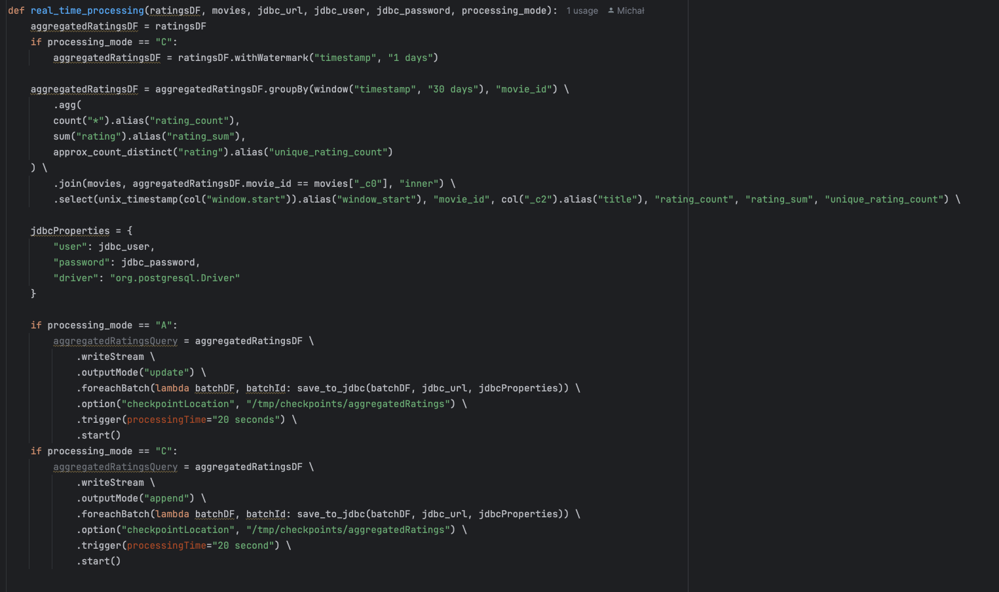
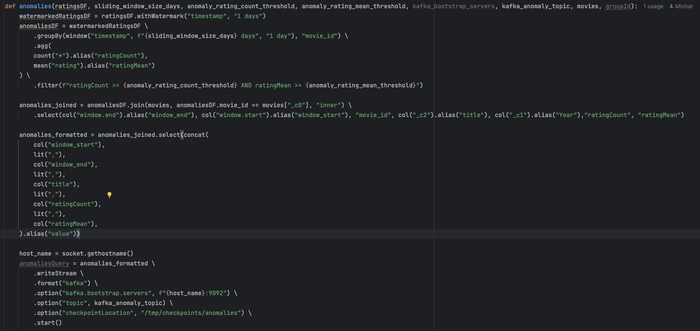
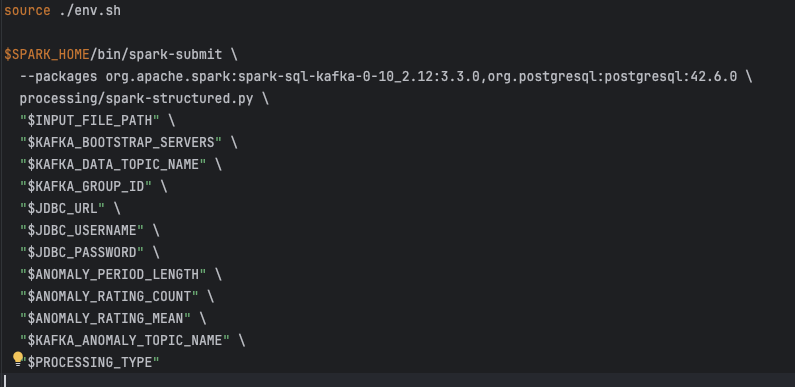
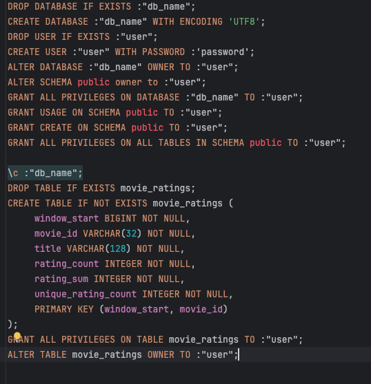

# Sprawozdanie

### Zestaw danych: Netflix-Prize-Data
### Technologia: Apache Spark Structured Streaming

## Producent; skrypty inicjujące i zasilający

Uruchamiamy cluster dataproc i przechodzimy do konsoli węzła master
```shell
gcloud dataproc clusters create ${CLUSTER_NAME} \
--enable-component-gateway --bucket ${BUCKET_NAME} --region ${REGION} --subnet default \
--master-machine-type n1-standard-4 --master-boot-disk-size 50 \
--num-workers 2 --worker-machine-type n1-standard-2 --worker-boot-disk-size 50 \
--image-version 2.1-debian11 --optional-components DOCKER,ZOOKEEPER \
--project ${PROJECT_ID} --max-age=2h \
--metadata "run-on-master=true" \
--initialization-actions \
gs://goog-dataproc-initialization-actions-${REGION}/kafka/kafka.sh
```

Pobieramy repozytorium ze skryptami i uruchamiamy skrypt inicjujący środowisko.  
Alternatywnie możemy rozpakować archiwum z kodem źródłowym.
```shell
git clone https://github.com/MichalxPZ/Spark-Structured-Streaming---Netflix-Prize-Data.git
mv Spark-Structured-Streaming---Netflix-Prize-Data/* .
rm -rf Spark-Structured-Streaming---Netflix-Prize-Data
```

Inicjalizujemy zmienne środowiskowe - możliwość edycji w pliku env.sh  
Pobieramy dane, budujemy kody źródłowe oraz uruchamiamy kontener z postgresem.   
Inicjalizujemy również schemat bazy danych i nadajemy odpowiednie uprawnienia.  

```shell
source ./setup.sh
```

Polecenie uruchamiające producenta danych
```shell
source ./kafka_producer.sh
```

## Konsument: skrypt odczytujący wyniki przetwarzania

Aplikacja posiada dwóch konsumentów, którzy odczytują dane z bazy danych lub tematu Kafki.  
Domyślnie konsument nasłuchujący na temat kafki zbiera dane dotyczące anomalii przetwarzania.
```shell
source ./kafka_consumer.sh
```


Konsument typu jdbc odczytuje dane zagregowane.
```shell
source ./jdbc_consumer.sh
```


## Utrzymanie obrazu czasu rzeczywistego – transformacje 
Aby uruchomić przetwarzanie strumieniowe, należy uruchomić skrypt
```shell
source ./processing_engine.sh
```

### Ogólna idea przetwarzania danych
1. #### Pobieranie danych z Kafki
   Dane są pobierane z tematu Kafki (kafka_topic), które są w formacie CSV z czterema kolumnami: timestamp, movie_id, user_id i rating.
   Te dane są przetwarzane strumieniowo przy użyciu Spark Structured Streaming.
   Strumień danych jest odczytywany za pomocą SparkSession, a wartości są parsowane i przekształcane na odpowiednie typy danych.
2. #### Agregowanie danych
    ##### Grupowanie i agregacja:
    Dane są grupowane według 30-dniowego okna czasowego i movie_id.
    Agregaty obejmują liczbę ocen (rating_count), sumę ocen (rating_sum) oraz liczbę unikalnych ocen (unique_rating_count).
    Zapis do bazy danych:

    Wyniki agregacji są zapisywane do bazy danych PostgreSQL.
    W zależności od trybu przetwarzania (A dla trybu "append" i C dla trybu "complete").
3. #### Wykrywanie anomalii    
    ##### Watermark i grupowanie:
    
    Dane są przetwarzane z 1-dniowym watermarkiem, co pozwala na tolerowanie opóźnień w strumieniu danych.
    Dane są grupowane według okna czasowego (zdefiniowanego przez sliding_window_size_days) i movie_id.
    ##### Wykrywanie anomalii:
    
    Wyliczane są średnie oceny (ratingMean) i liczba ocen (ratingCount) dla każdego okna czasowego i movie_id.
    Anomalie są wykrywane, jeśli liczba ocen i średnia ocena przekraczają odpowiednie progi (anomaly_rating_count_threshold i anomaly_rating_mean_threshold).
    ##### Zapis anomalii do Kafki:
    
    Zidentyfikowane anomalie są wysyłane z powrotem do tematu Kafki (kafka_anomaly_topic).

## Utrzymanie obrazu czasu rzeczywistego – obsługa trybów
W zależności od pamateru ustawionego w pliku env.sh, aplikacja działa w jednym z dwóch trybów: A lub C.
1. W pierwszym (delay=A) program ma dostarczać dane do obrazu czasu rzeczywistego z najmniejszym
możliwym opóźnieniem, nawet jeśli dostarczane wyniki nie są ostateczne i będzie trzeba je wielokrotnie
aktualizować.
2.  W drugim (delay=C) program ma dostarczać dane do obrazu czasu rzeczywistego najszybciej jak się da, ale
tylko wyniki ostateczne, tak aby nie było potrzeby ich późniejszej aktualizacji.  



Tryb A - anomalie nie występują (należy zmienić wartość w pliku env.sh)
```shell
export ANOMALY_PERIOD_LENGTH=30
export ANOMALY_RATING_COUNT=70
export ANOMALY_RATING_MEAN=4
```
Tryb C - anomalie występują stosunkowo często (należy zmienić wartość w pliku env.sh)
```shell
export ANOMALY_PERIOD_LENGTH=1
export ANOMALY_RATING_COUNT=2
export ANOMALY_RATING_MEAN=2
```

## Wykrywanie anomalii
Aplikacja wykrywa anomalie w danych, jeśli liczba ocen i średnia ocena przekraczają odpowiednie progi.  
Progi te są zdefiniowane w pliku env.sh.


## Program przetwarzający strumienie danych; skrypt uruchamiający
Aby uruchomić przetwarzanie strumieniowe, należy uruchomić skrypt
```shell
source ./processing_engine.sh
```


## Miejsce utrzymywania obrazów czasu rzeczywistego – skrypt tworzący
Miejsce utrzymywania obrazów czasu rzeczywistego jest tworzone w skrypcie setup.sh  
Jest to kontener z bazą PostgreSQL, który jest uruchamiany w klastrze dataproc.  
Schematy bazy danych oraz tabele są tworzone w skrypcie setup.sql  


## Miejsce utrzymywania obrazów czasu rzeczywistego – cechy
PostgreSQL jest idealny do przechowywania zagregowanych danych w procesach Big Data dzięki skalowalności, która umożliwia obsługę dużych wolumenów danych, oraz zaawansowanym funkcjom analitycznym i agregacyjnym. Dzięki wsparciu dla równoległego przetwarzania zapytań i optymalizacji wydajności, PostgreSQL efektywnie zarządza skomplikowanymi analizami na dużych zbiorach danych. Dodatkowo, łatwa integracja z narzędziami Big Data i elastyczność w obsłudze różnych typów danych czynią go wszechstronnym rozwiązaniem.

## Czyszczenie środowiska
Aby wyczyścić środowisko, należy uruchomić skrypt
```shell
source ./cleanup.sh
```